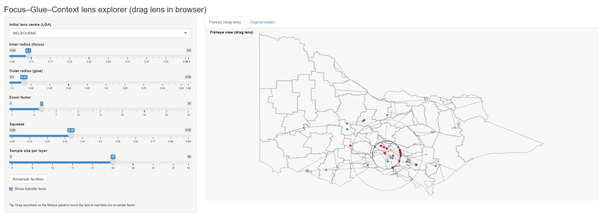

```{r setup, include=FALSE}
knitr::opts_chunk$set(echo = FALSE, warning = FALSE, message = FALSE)
library(tidyverse)
library(mapycusmaximus)
library(geogrid)
library(sf)
library(units)
library(ggthemes)
library(cowplot)
library(RColorBrewer)
library(cartogram)
library(patchwork)
library(ggrepel)
library(DiagrammeR)
library(rsvg)
library(DiagrammeRsvg)
library(stringr)
library(janitor)
library(plotly)
library(sugarbag)
```

# Introduction

Maps that reveal fine local structure without losing broader context face a persistent challenge: zooming in hides regional patterns, while small-scale views suppress local detail. Traditional solutions such as insets and multi-panel displays break spatial continuity and increase cognitive load [@cockburn2008].

We introduce `mapycusmaximus`, an R package which implements a Focus-Glue-Context (FGC) fisheye transformation that continuously warps geographic space. The transformation magnifies a chosen focus region, compresses surrounding areas into a transitional glue zone, and maintains stability in the outer context. The approach operates directly on vector geometry coordinates, preserves topology, and supports a reproducible, pipeline-oriented cartography within the R `sf` and `ggplot2` ecosystem. An optional glue-zone twist (the `revolution` parameter) can gently rotate features to aid continuity.

```{r intro-snippet, eval=FALSE}
# Minimal usage: warp an sf layer around a focal polygon
melb <- vic |> dplyr::filter(LGA_NAME == "MELBOURNE")
vic_fish <- sf_fisheye(vic, center = melb, r_in = 0.33, r_out = 0.60,
                       zoom = 1.8, squeeze = 0.35)
```

The development of focus+context visualization traces back to @furnas1986's *degree-of-interest* (DOI) function, which introduced a formal method to rank information elements by combining intrinsic importance with distance from the user's focus. In this model, items with low DOI are de-emphasized or hidden, enabling emphasis on salient regions without losing global structure. @sarkar1992 [@sarkar1994] extended this to geometric distortion, demonstrating smooth magnification transitions for graph visualization. Other approaches to this problem include hyperbolic geometry for hierarchies [@lamping1995], distortion-view frameworks [@carpendale2001], and "magic lens" overlays [@bier1993]. A 2008 review from @cockburn2008's covers two decades of research across overview+detail, zooming, and focus+context paradigms.

In cartography, the need for nonlinear magnification emerged independently. @snyder1987 developed "magnifying-glass" azimuthal projections with variable radial scales. @harrie2002 created variable-scale functions for mobile devices where user position appears large-scale against small-scale surroundings. An influential contribution came from @yamamoto2009 [@yamamoto2012], who introduced the **Focus+Glue+Context model**, in which the intermediate "glue" region absorbs distortion, preventing the excessively warped roads and boundaries that were seen in earlier fisheye maps. This three-zone architecture proved particularly effective for pedestrian navigation and mobile web services.

Despite the Focus+Glue+Context model being introduced more than a decade ago, there is currently no native R solution for implementing these models. The package `mapycusmaximus` fills this niche by providing a general function to perform these transformations, as well as integrations to work natively within the R spatial ecosystem with `sf` [@RJ-2018-009].

# Background

First, we briefly review the current R-based solutions to the detail-versus-context tradeoff. Ths includes multi-panel approaches, hexagon tile maps and cartograms.

```{r data-preparation-pop, eval=FALSE}
# Library
# Load the population per states (source: https://www.abs.gov.au/methodologies/data-region-methodology/2011-25#data-downloads)
pop <- readxl::read_xlsx("data/14100DO0001_2011-25.xlsx",sheet = 3, skip = 6)
# This file is too big to keep, or add to paper submission. 
# A subset is created and saved.

# Use only 2024 data and total population
pop <- pop |>
  filter(Year == 2024) |>
  select(Code, Label, Year, `Estimated resident population (no.)`) |>
  rename(pop = `Estimated resident population (no.)`,
         code = Code, label = Label, year = Year) |>
  mutate(pop = as.numeric(pop)/100000)

# It will be easier if we remove duplicated names, that include State 
# Only keep the Vic values
pop <- pop |>
  filter(!str_detect(label, "Unincorp")) |>
  filter(!str_detect(label, "\\(NSW\\)")) |>
  filter(!str_detect(label, "\\(SA\\)")) |>
  filter(!str_detect(label, "\\(Tas.\\)")) |>
  filter(!str_detect(label, "\\(Qld\\)")) 
# There are still LGAs from other states but these will drop out from the merge.

save(pop, file="data/pop.rda")
```
 

```{r merge-pop-with-spatial}
# Join to geography, only the regions in the spatial polygon data
clean_lga <- function(x) {
  x |>
    str_to_upper() |>
    str_replace_all("\\s*\\(.*\\)$", "") |>   # drop trailing "(Vic)" etc.
    str_squish()
}

load("data/pop.rda")
pop <- pop |> 
  mutate(lga_key = clean_lga(label))

data("vic")
vic <- vic |>
  rename(lga_key = LGA_NAME)
vic_pop_sf <- left_join(vic, pop, by = "lga_key")
vic_pop_merc <- st_transform(vic_pop_sf, 3857)

```

Tools like `cowplot::ggdraw()`[@cowplot] can create multi-panel plots, with one panel showing an overview, and another shows zoomed detail (Figure \@ref(fig:cow-plot-plot)).

```{r data-cow-plot, include=FALSE}
# Select the LGAs in the Greater Melbourne area to create inset map
greater_melbourne <- c(
  "BANYULE", "BAYSIDE", "BOROONDARA", "BRIMBANK", "CARDINIA", "CASEY",
  "DAREBIN", "FRANKSTON", "GLEN EIRA", "GREATER DANDENONG",
  "HOBSONS BAY", "HUME", "KINGSTON", "KNOX", "MARIBYRNONG",
  "MANNINGHAM", "MAROONDAH", "MELBOURNE", "MELTON", "MERRI-BEK",
  "MONASH", "MOONEE VALLEY", "MORNINGTON PENINSULA",
  "NILLUMBIK", "PORT PHILLIP", "STONNINGTON", "WHITEHORSE",
  "WHITTLESEA", "WYNDHAM", "YARRA", "YARRA RANGES"
)

lga_inset <- vic_pop_sf[vic_pop_merc$lga_key %in% greater_melbourne, ]
main_map <- ggplot() +
 geom_sf(data = vic_pop_merc, aes(fill = pop), color = "white") +
 geom_sf(data = lga_inset, aes(fill = pop), color = "black") + 
  scale_fill_viridis_c("Pop ('00000)", direction = -1) +
  theme_map() +
  theme(
    legend.position = "top",
    legend.direction = "horizontal",
    plot.title = element_text(size = 12, face = "bold"),
    legend.title = element_text(size = 9),
    legend.text  = element_text(size = 8)
  )
inset_map <- ggplot() +
  geom_sf(data = lga_inset, aes(fill = pop), 
          color = "white", linewidth = 0.2) +
  scale_fill_viridis_c("Pop ('00000)", direction = -1) +
  labs(title = "Greater Melbourne") +
  theme_map() +
  theme(
    legend.position = "none",
    plot.title = element_text(size = 9, face = "bold", hjust = 0.5)
  )
```

```{r cow-plot-plot, echo=FALSE, fig.cap="Overview map with inset showing Greater Melbourne. The main panel displays Victoria, while a secondary inset zooms into metropolitan Melbourne. The separation highlights local detail but requires the reader to mentally integrate focus and context across panels.", fig.width=8, fig.height=6, layout="l-body", out.width="100%"}
final_map <- ggdraw() +
 draw_plot(main_map, x = 0, y = 0, width = 1, height = 1) + # Main map occupies the whole canvas
 draw_plot(inset_map, x = 0.5, y = 0.5, width = 0.4, height = 0.4) # Inset map position and size

print(final_map)
```

These are potentially the most practical approach to the detail-versus-context tradeoff, and may effective for static reports, but require viewers to mentally integrate separate views, and don't preserve the *embedded* relationship between focus and context within a single continuous geography. The lack of continuous geography also presents challenges if additional elements such as fill colour are introduced to the plot.

A solution to the lack of continuous geometry is the hexagonal tilemap, such as that implemented by the `sugarbag` package [REF]. In these maps, a number of tiles are placed in each region of the map, approximately proportional to the size of the population of the region. As a result, large areas with small populations receive relatively few tiles, while small areas with large populations receive many more tiles, meaning that the density of tiles more accurately reflects the number of data points in a region.

```{r sugarbag-prepare, include=FALSE}
centroids <- create_centroids(vic_pop_sf, "lga_key")
grid <- create_grid(centroids = centroids, 
                    hex_size = 0.2, 
                    buffer_dist = 1.2)
hex_allocated <- allocate(
  centroids = centroids,
  hex_grid = grid,
  hex_size = 0.2, # same size used in create_grid
  hex_filter = 3,
  focal_points = capital_cities,
  width = 30, 
  verbose = TRUE
)

```

```{r prepare-sugarbag-plot}
hexagons <- fortify_hexagon(
  data    = hex_allocated,
  sf_id   = "lga_key",
  hex_size = 0.2
) |>
  left_join(pop)

polygons <- fortify_sfc(vic) %>% 
  mutate(poly_type = "geo") |> 
  mutate(layer = "base")

hextilemap <- ggplot() +
  geom_sf(data = vic_pop_sf, fill = "grey85", color = "white") +
  geom_polygon(
    data = hexagons,
    aes(x = long, y = lat, group = lga_key, 
        fill = pop, label=lga_key), #,
    colour = "grey20", linewidth = 0.3
  ) +
  scale_fill_viridis_c("Pop ('00000)", direction = -1) +
  theme_map() +
  theme(
    legend.position = c(0.5, 0.9),
    legend.direction = "horizontal",
  )
```


```{r sugarbag-plot-pdf, echo=FALSE, fig.cap="Sugarbag hex tile map illustrating thematic spatial abstraction. Original LGA polygons are replaced by uniform hexagons, with fill indicating poplulation and original geography shown faintly beneath. This representation removes area bias but sacrifices precise geographic location.", eval=knitr::is_latex_output(), fig.width=8, fig.height=6, layout="l-body", out.width="100%"}
hextilemap
```

```{r sugarbag-plot-html, echo=FALSE, fig.cap="Sugarbag hex tile map illustrating thematic spatial abstraction. Original LGA polygons are replaced by uniform hexagons, with fill indicating poplulation and original geography shown faintly beneath. This representation removes area bias but sacrifices precise geographic location.", eval=knitr::is_html_output(), fig.width=8, fig.height=6, layout="l-body", out.width="100%"}
ggplotly(hextilemap, tooltip = "label", width=800, height=500) |> layout(
  #title = list(text = "Another look on the Victoria population", x = 0.5),
  legend = list(
    orientation = "h",
    x = 0.5, xanchor = "center",
    y = 1.07, yanchor = "top"  # inside the plot area
  ),
  margin = list(t = 60)
)
```

The challenge with tile maps is that they abstract away precise geography entirely, treating space as a topology-preserving tessellation where "neighbors touch" matters more than accurate boundaries. Tile maps excel at avoiding size bias. However, they abandon continuous spatial relationships. As a result, you cannot identify precise locations, measure distances, or overlay point data meaningfully. In Figure \@ref(fig:`r ifelse(knitr::is_html_output(), 'sugarbag-plot-html', 'sugarbag-plot-pdf')`), the sugarbag approach was overlaid on top of the original geography, and it is difficult to discern which tiles belong to which geographic area.

A third approach is a cartogram plot. In these plots, areas are intentionally distorted to ensure an area reflects the density of a variable. The most common approach is to distort the shapes such that the area becomes proportional to population [@gastner2004]. Figure \@ref(fig:`r ifelse(knitr::is_html_output(), 'plot-cart-html', 'plot-cart')`) shows a cartogram for Victorian local government areas (LGAs) where color indicates population, and polygons are distorted proportionally to population. Notice how, in comparison to \@ref(fig:cow-plot-plot), the areas in the south where the bulk of the Victorian population resides take up a majority of the plot.

```{r data-cart, include=FALSE}
cartogram <- cartogram_cont(vic_pop_merc, "pop", itermax = 3)
# Back to original projection
cartogram <- st_transform(cartogram, st_crs(vic_pop_sf)) |>
  st_make_valid() |>
  st_collection_extract("POLYGON") |>
  st_cast("MULTIPOLYGON")

carto_plot <- ggplot(cartogram) +
  geom_sf(aes(fill = pop, label=lga_key),
          color = "white") +
  scale_fill_viridis_c("Pop ('00000)", direction = -1) +
  theme_void() +
  theme(
    legend.position = c(0.5, 0.9),
    legend.direction = "horizontal",
    text = element_text(color = "#22211d"),
    plot.background = element_rect(fill = "white", color = NA),
    panel.background = element_rect(fill = "white", color = NA),
    legend.background = element_rect(fill = "white", color = NA)
  )
```

```{r plot-cart, echo=FALSE, fig.cap="Population of Victorian LGAs shown as a diffusion cartogram. Colour (and size) indicates population. We can see that the LGAs for greater Melbourne have the highest population, and these are massively exploded.", eval=knitr::is_latex_output(), fig.align="center", fig.width=8, fig.height=6, layout="l-body", out.width="100%"}

carto_plot
```

```{r plot-cart-html, echo=FALSE, fig.cap="Population of Victorian LGAs shown as a diffusion cartogram. Colour (and size) indicates population. We can see that the LGAs for greater Melbourne have the highest population, and these are massively exploded.", eval=knitr::is_html_output(), fig.align="center", fig.width=8, fig.height=6, layout="l-body", out.width="100%"}

ggplotly(carto_plot, tooltip = "label", width=800, height=500) |> 
  layout(
  legend = list(
    orientation = "h",
    x = 0.5, xanchor = "center",
    y = 1.07, yanchor = "top"  # inside the plot area
  ),
  margin = list(t = 60)
)

```

This approach fundamentally differs from focus+context methods. Cartograms substitute spatial accuracy for data encoding, often severely disrupting shapes and adjacencies. The reader can still extract geographic features and relationships, as the cartogram preserves relative positions and topology, however, the shape and size are distorted. 

In contrast, the FGC fisheye transformation preserves relative positions and topology while magnifying a user-selected spatial region rather than a data-driven variable. The use cases are distinct: cartograms address the dominance of a variable in space, whereas fisheye lenses facilitate exploration of local detail within a broader geographic context.

### Focus-Glue-Context and the fisheye transformation

None of these approaches provide continuous geometric magnification within a single, topology-preserving map. The fisheye lens keeps everything in one frame-roads bend smoothly, metropolitan detail enlarges, but you still see how the city sits within its state. It's a geometric *warp* rather than a data-driven *substitution* or panel-based *separation*. This matters for use cases like: examining hospital networks in Melbourne while maintaining Victorian context, exploring census tracts in a metro core without losing county boundaries, or analyzing transit lines with their regional hinterland visible.

With this landscape established, we now turn to the technical implementation: how does the FGC transformation actually work, and how does this package make it accessible within R's spatial workflows?

# Implementation

```{r preparing-data, include=FALSE}

plot_fisheye_fgc <- function(original_coords, transformed_coords, 
  cx = 0, cy = 0, r_in = 0.34, r_out = 0.5) {

# Create data frames for plotting
  zones <- classify_zones(original_coords, cx, cy, r_in, r_out)

  original_df <- data.frame(
    x = original_coords[, 1],
    y = original_coords[, 2],
    zone = zones,
    type = "Original"
  )

  transformed_df <- data.frame(
    x = transformed_coords[, 1],
    y = transformed_coords[, 2], 
    zone = zones,
    type = "Transformed"
  )

  combined_df <- rbind(original_df, transformed_df)

  # Create the plot
  p <- ggplot(combined_df, aes(x = x, y = y, color = zone)) +
    geom_point(size = 1.5, alpha = 0.8) +
    scale_color_manual(values = c("focus" = "#c60000ff", 
      "glue" = "#a5a9e8ff", 
      "context" = "#FFCC00")) +
    facet_wrap(~type) +
    coord_fixed() +
    theme_minimal() +
    theme(
      panel.grid.minor = element_blank(),
      legend.title = element_blank()
    ) +
    labs(title = "Fisheye FGC Transformation",
    subtitle = paste("r_in =", r_in, ", r_out =", r_out))

  # Add zone boundary circles
  if (r_in > 0) {
    circle_in <- data.frame(
      x = cx + r_in * cos(seq(0, 2*pi, length.out = 100)),
      y = cy + r_in * sin(seq(0, 2*pi, length.out = 100))
    )
  p <- p + geom_path(data = circle_in, aes(x = x, y = y), 
    color = "red", linetype = "dashed", inherit.aes = FALSE)
  }

  circle_out <- data.frame(
    x = cx + r_out * cos(seq(0, 2*pi, length.out = 100)),
    y = cy + r_out * sin(seq(0, 2*pi, length.out = 100))
  )
  p <- p + geom_path(data = circle_out, aes(x = x, y = y), 
    color = "blue", linetype = "dashed", inherit.aes = FALSE)

    return(p)
}
```

```{r fgc-zones, echo=FALSE, fig.cap="Illustration of Focus-Glue-Context zones in a fisheye transformation. Original grid points are shown alongside their transformed positions, coloured by zone, with arrows indicating displacement. Points expand in the focus, compress smoothly in the glue, and remain fixed in the context."}

grid <- create_test_grid()
grid_df <- as_tibble(grid)
transform <- fisheye_fgc(grid, cx = 0, cy = 0, r_in = 0.34, r_out = 0.5)
transform_df <- as_tibble(transform) |>
  dplyr::mutate(
    zone = attr(transform, "zones"),
    r_orig = attr(transform, "original_radius"),
    r_new  = attr(transform, "new_radius")
  )
arrows_df <- cbind(grid_df, transform_df)

ggplot() +
  # Draw arrows showing movement
  # Original points
  geom_point(
    data = grid_df, aes(x = x, y = y),
    size = 0.6, alpha = 0.7, color = "#8080e0ff"
  ) +
  # Transformed points
  geom_point(
    data = transform_df, aes(x = x_new, y = y_new, color = zone),
    size = 0.6, alpha = 0.7
  ) +
  scale_color_manual(values = c("focus" = "#c60000ff", 
  "glue" = "#070737ff", 
  "context" = "#FFCC00")) +
    geom_segment(
  data = arrows_df |>
    filter(
      zone != "context",
      sqrt((x_new - x)^2 + (y_new - y)^2) > 1e-6  # only draw if moved
    ),
  aes(x = x, y = y, xend = x_new, yend = y_new, color = zone),
  arrow = arrow(length = unit(0.02, "npc")),
  alpha = 0.6,
  size = 0.5
) +
  scale_color_manual(values = c("focus" = "#c60000ff", 
     "glue" = "#070737ff", 
     "context" = "#FFCC00")) +
  coord_equal() +
  theme_minimal(base_size = 14) +
  labs(title = "Fisheye Transformation: Point Movement", x = "x", y = "y")

```

Consider a point $P = (x, y)$ in a projected coordinate system. The analyst chooses a center $C = (c_x, c_y)$ and two radii: $r_{\text{in}}$ delineating the focus region and $r_{\text{out}}$ marking the glue boundary. Points inside the focus magnify, points between the radii focus on the center and then compress according to a smooth curve, and points outside remain unchanged. This radial scheme keeps angular coordinates intact, thereby preserving bearings and relative direction.

## Algorithm

Let $(r, \theta)$ denote the polar form of point $P = (x, y)$ relative to center $C = (c_x, c_y)$. The transformation defines a new radius $r'$ via a piecewise function:

\begin{equation} 
 r' = 
 \begin{cases}
   \min\left( z \cdot r, r_{\text{in}} \right) & \text{if } r \le r_{\text{in}}, \\
   r_{\text{in}} + (r_{\text{out}} - r_{\text{in}}) \cdot h(u; s) & \text{if } r_{\text{in}} < r \le r_{\text{out}}, \\
   r & \text{if } r > r_{\text{out}},
 \end{cases}
\end{equation}

where $z > 1$ is the zoom factor within the focus, $s \in (0, 1]$ controls glue compression, and $u = { (r - r_{\text{in}}) }/{ (r_{\text{out}} - r_{\text{in}}) }$ normalizes the glue radius to $[0,1]$. The function $h(u; s)$ is chosen so that $h(0; s) = 0$, $h(1; s) = 1$, and both the first derivatives and the radii match at the boundaries. We adopt a symmetric power curve function,

\begin{equation} 
 h(u; s) = 
 \begin{cases}
   \tfrac{1}{2} \cdot u^{1/s} & \text{if } 0 \le u \le 0.5, \\
   1 - \tfrac{1}{2} \cdot (1 - u)^{1/s} & \text{if } 0.5 < u \le 1,
 \end{cases}
\end{equation}

which compresses radii near both boundaries and emphasizes the mid-glue region. An alternative approach which implements outward compression which biases the curve towards $r_{\text{out}}$ is also implemented with parameter `"outward"`. A demonstration on how original and transformed radius can be seen at the Figure \@ref(fig:radial-curve). The transform optionally introduces rotation within the glue zone to accentuate the flow from detail to context. Let $\phi(u)$ denote the angular adjustment. We employ a bell-shaped profile: $\phi(u) = \rho \cdot 4u(1-u)$, where $\rho$ is the revolution parameter (in radians). This function peaks at the glue midpoint and vanishes at the boundaries, ensuring continuity.

```{r radial-curve, fig.cap="Radial mapping function of the FGC fisheye. The plot shows original radius r against warped radius r', with shaded focus, glue, and context regions and a reference identity line. The curve demonstrates expansion in the focus, smooth compression in the glue, and identity mapping outside.", out.width="120%"}
r_in  <- 0.34
r_out <- 0.55

rad <- tibble::tibble(r = seq(0, 1, length.out = 400))
xy  <- cbind(rad$r, 0)
xy2 <- fisheye_fgc(xy, r_in = r_in, r_out = r_out,
                    zoom_factor = 3, squeeze_factor = 0.35,
                    method = "outward")
xy2 <- xy2 |>
  as_tibble() |>
  mutate(zone = attr(xy2, "zones"),
          r1   = attr(xy2, "original_radius"),
          r2   = attr(xy2, "new_radius"))

# Points on the curve closest to r_in and r_out (for targeted labels)
i_in  <- which.min(abs(xy2$r1 - r_in))
i_out <- which.min(abs(xy2$r1 - r_out))
pt_in  <- xy2[i_in,  c("r1", "r2")]
pt_out <- xy2[i_out, c("r1", "r2")]
i_maxF <- which.max(if_else(xy2$r1 <= r_in, xy2$r2, NA_real_))

ggplot(xy2, aes(r1, r2, color = zone)) +
  # Light zone shading by r (x-axis)
  annotate("rect", xmin = 0,     xmax = r_in,  ymin = -Inf, ymax = Inf,
            fill = "#c60000", alpha = 0.05) +
  annotate("rect", xmin = r_in,  xmax = r_out, ymin = -Inf, ymax = Inf,
            fill = "#6c8ae6", alpha = 0.05) +
  annotate("rect", xmin = r_out, xmax = 1,     ymin = -Inf, ymax = Inf,
            fill = "#ffb000", alpha = 0.05) +
  # Curve + references
  geom_line(size = 1.1) +
  geom_abline(intercept = 0, slope = 1, linetype = "dashed",
              color = "steelblue", alpha = 0.6) +
  geom_vline(xintercept = c(r_in, r_out), linetype = c("dashed", "dotted"),
              color = "grey40") +
  geom_hline(yintercept = c(r_in, r_out), linetype = c("dashed", "dotted"),
              color = "grey40") +
  annotate("label", x = r_in,  y = 0.05, label = "r_in",  angle = 90, vjust = -0.5) +
  annotate("label", x = r_out, y = 0.05, label = "r_out", angle = 90, vjust = -0.5) +
  annotate("label", y = r_in + 0.03,  x = 0.05, label = "r_in") +
  annotate("label", y = r_out  + 0.03, x = 0.05, label = "r_out") +
  annotate("label", x = 0.88, y = 0.88, label = "identity: r' = r",
            color = "steelblue", fill = "white") +
  # Arrows to the curve at r_in / r_out
  annotate(
    "curve",
    x = r_in + 0.07, y = r_in + 0.02,
    xend = pt_in$r1, yend = pt_in$r2,
    curvature = 0.2,
    arrow = arrow(type = "closed", length = unit(6, "pt"))
  ) +
  annotate("label", x = r_in + 0.08, y = r_in + 0.04, label = "expansion at r_in",
            color = "steelblue", fill = "white") +
  annotate(
    "curve",
    x = r_out - 0.12, y = r_out + 0.08,
    xend = pt_out$r1, yend = pt_out$r2,
    curvature = -0.2,
    arrow = arrow(type = "closed", length = unit(6, "pt"))
  ) +
  annotate("label", x = r_out - 0.13, y = r_out + 0.09, label = "compression at r_out",
            color = "steelblue", fill = "white") +
  # Arrow to the inner radius
  geom_point(aes(x = r1, y = r2), data = xy2[i_maxF, ], size = 1, color = "black") +
  annotate(
    "curve",
    x = r_in * 0.55, y = r_in * 0.40,
    xend = xy2$r1[i_maxF], yend = xy2$r2[i_maxF],
    curvature = 0.2,
    arrow = arrow(type = "closed", length = unit(4, "pt"))
  ) +
  annotate("label", x = r_in, y = r_in * 0.5,
            label = "shifted radius (expansion) in focus \n then flattened at r_in",
            color = "steelblue", fill = "white") +
  # Visual cue for flattening at r_in (horizontal tangent/cap)
  scale_color_manual(values = c(focus = "#c60000", glue = "#6c8ae6", context = "#ffb000"),
                      name = "Zone") +
  coord_fixed(xlim = c(0, 1), ylim = c(0, 1), ratio = 1) +
  labs(x = "r (original)", y = "r' (warped)") +
  theme_minimal(base_size = 10)
```

## Integration with sf

Spatial datasets vary widely in CRS, extent, feature types, and schema. mapycusmaximus follows a disciplined staged workflow where each step is explicit, auditable, and invariant to input type. The architecture separates numeric mapping, spatial orchestration, and geometry reconstruction, allowing the core transform to remain small and testable while sf-specific concerns are isolated in thin wrappers.

### Workflow and CRS handling

The pipeline proceeds: **sanitize input** -\> **select working CRS** -\> **normalize** -\> **warp** -\> **denormalize** -\> **restore original CRS**. Empty geometries are dropped and `sf::st_zm()` enforces 2D coordinates.

#### CRS selection

If the layer is already in a projected CRS, that CRS is used. If it is geographic (lon/lat), the data are transformed to a sensible local projected CRS (for example: UTM inferred from the centroid; for Victoria, GDA2020/MGA55 is typical). Distances are then in metres and parameters behave consistently. The original CRS is restored on return.

#### Normalization

```{r norm-diagram, fig.cap="Workflow diagram of the normalization and CRS handling pipeline. The flowchart depicts CRS selection, normalization, center resolution, fisheye application, and CRS restoration. This highlights the staged design ensuring projection awareness and parameter stability.", eval=knitr::is_html_output(), fig.align="center", width=1, height=4, out.width="200%", layout="l-body"}
grViz("
digraph fgc {
  rankdir=TB; nodesep=0.25; ranksep=0.4;
  node [shape=rect, style=rounded, fontsize=10, fontname=Helvetica, fillcolor='#f5f5f9', color='#4e4d47', style=filled];
  edge [color='#4e79a7', arrowsize=.7];

  A [label='Input sf/sfc or matrix\\noptions: center, preserve_aspect, normalized_center'];
  B [shape=diamond, label='Projected?', fillcolor='#eef3ff'];
  C [label='Use layer CRS'];
  D [label='Transform to projected CRS\\n(UTM / GDA2020)'];
  E [label='BBox (xmin,xmax,ymin,ymax)'];
  F [label='Compute mid + half-spans'];
  G [shape=diamond, label='Preserve aspect?', fillcolor='#eef3ff'];
  H [label='Use s=max(sx,sy)'];
  I [label='Use sx,sy independently'];
  J [shape=diamond, label='Resolve center', fillcolor='#eef3ff'];
  K [label='sf/sfc -> centroid'];
  L [label='numeric + CRS -> transform'];
  M [label='numeric only -> lon/lat heuristic'];
  N [label='normalized_center -> (mx,my)+center*scale'];
  O [label='Normalize to unit space'];
  P [label='Apply fisheye'];
  Q [label='Denormalize'];
  R [label='Restore CRS'];

  A -> B; 
  B -> C [label='yes']; 
  B -> D [label='no'];
  C -> E; 
  D -> E; 
  E -> F; 
  F -> G;
  G -> H [label='yes']; 
  G -> I [label='no'];
  H -> J; 
  I -> J;
  J -> K; 
  J -> L; 
  J -> M; 
  J -> N;
  K -> O; 
  L -> O; 
  M -> O; 
  N -> O;
  O -> P; 
  P -> Q; 
  Q -> R;
}
")
```

```{r norm-diagram-pdf, eval=knitr::is_latex_output()}

# Static version for PDF using DiagrammeR's export

diagram <- grViz("
digraph fgc {
  rankdir=TB; nodesep=0.25; ranksep=0.4;
  node [shape=rect, style=rounded, fontsize=10, fontname=Helvetica, fillcolor='#f5f5f9', color='#4e4d47', style=filled];
  edge [color='#4e79a7', arrowsize=.7];

  A [label='Input sf/sfc or matrix\\noptions: center, preserve_aspect, normalized_center'];
  B [shape=diamond, label='Projected?', fillcolor='#eef3ff'];
  C [label='Use layer CRS'];
  D [label='Transform to projected CRS\\n(UTM / GDA2020)'];
  E [label='BBox (xmin,xmax,ymin,ymax)'];
  F [label='Compute mid + half-spans'];
  G [shape=diamond, label='Preserve aspect?', fillcolor='#eef3ff'];
  H [label='Use s=max(sx,sy)'];
  I [label='Use sx,sy independently'];
  J [shape=diamond, label='Resolve center', fillcolor='#eef3ff'];
  K [label='sf/sfc -> centroid'];
  L [label='numeric + CRS -> transform'];
  M [label='numeric only -> lon/lat heuristic'];
  N [label='normalized_center -> (mx,my)+center*scale'];
  O [label='Normalize to unit space'];
  P [label='Apply fisheye'];
  Q [label='Denormalize'];
  R [label='Restore CRS'];

  A -> B; 
  B -> C [label='yes']; 
  B -> D [label='no'];
  C -> E; 
  D -> E; 
  E -> F; 
  F -> G;
  G -> H [label='yes']; 
  G -> I [label='no'];
  H -> J; 
  I -> J;
  J -> K; 
  J -> L; 
  J -> M; 
  J -> N;
  K -> O; 
  L -> O; 
  M -> O; 
  N -> O;
  O -> P; 
  P -> Q; 
  Q -> R;
}
")

diagram |>
  export_svg() |>
  charToRaw() |>
  rsvg::rsvg_png("diagram.png")
```

```{r norm-diagram-gg, fig.cap="Workflow diagram of the normalization and CRS handling pipeline. The flowchart depicts CRS selection, normalization, center resolution, fisheye application, and CRS restoration. This highlights the staged design ensuring projection awareness and parameter stability.", eval=knitr::is_latex_output(), fig.align="center", out.width="80%"}
knitr::include_graphics("diagram.png")
```

A bounding box defines the normalizing scale. With `preserve_aspect = TRUE`, a uniform scale $s = \max(s_x, s_y)$ is applied; otherwise axes scale independently. Center resolution happens before normalization: `sf`/`sfc` centers reduce to a centroid then transform to the working CRS; numeric pairs with `center_crs` are transformed; numeric pairs without CRS are interpreted heuristically; with `normalized_center = TRUE`, pairs live in $[-1, 1]$ relative to the bbox midpoint. If no center is given, the bbox midpoint is used.

### Core transformation

The main function of the `mapycusmaximus` package is the `fisheye_fgc()` function, which maps an $n \times 2$ coordinate matrix to a new $n \times 2$ matrix using the equations given in Section **xxx**. The function takes arguments `cx` and `cy`, corresponding to the center point, `r_in` and `r_out`, denoting the borders of the transformed regions, `zoom_factor` corresponding to $z$ in the previous section, a squeeze factor, and potential angular transformation through the `revolution` argument, which corresponds to $\rho$.

```{r basic-example, fig.cap="Basic numeric example of an FGC fisheye transformation. A synthetic grid is shown before and after warping. The example isolates the core radial mapping independent of spatial geometry reconstruction.", fig.align="center", out.width="80%"}
original <- create_test_grid()
fisheye_org <- fisheye_fgc(original, r_in = 0.34, r_out = 0.55)
plot_fisheye_fgc(original, fisheye_org)
```

The resulting matrix contains the transformed coordinates in the same order as the input coordinates. The zone of each point, and the original and transformed radii of each point from the specified center are returned as invisible attributes named `zones`, `original_radius` and `new_radius` respectively. The choice to return a 2-column matrix was specifically made to ensure ease of operation with `sf` coordinate construction functions.

```{r fisheye-attributes}
fisheye_org |> head()
fisheye_org |> attributes() |> names()
```

Numeric stability at zone boundaries is ensured by clamping expansions in the focus so radii do not exceed $r_{in}$, and using smooth power curves in the glue so derivatives match across boundaries. The radial mapping is vectorized and runs in linear time in the number of vertices as seen in the benchmark \@ref(fig:bench-plot).

```{r bench-data, eval=FALSE}
library(microbenchmark)

gen_xy <- function(n) matrix(runif(2L*n, -1, 1), ncol = 2)

bench_core <- function(ns = c(1e3, 2e3, 5e3, 1e4, 2e4, 5e4, 1e5), times = 10L) {
  r_in <- 0.34; r_out <- 0.55
  res <- lapply(ns, function(n) {
    xy <- gen_xy(n)
    invisible(fisheye_fgc(xy, r_in = r_in, r_out = r_out, zoom_factor = 1.6, squeeze_factor = 0.35)) # warm-up
    b <- microbenchmark(
      fisheye_fgc(xy, r_in = r_in, r_out = r_out, zoom_factor = 1.6, squeeze_factor = 0.35),
      times = times, unit = "ms"
    )
    data.frame(
      n = n,
      median_ms = median(b$time),
      per_vertex_ns = 1e6 * median(b$time) / n
    )
  })
  df <- bind_rows(res) |>
    mutate(logn = log(n), logt = log(median_ms))
  slope <- coef(lm(logt ~ logn, data = df))[2]
  list(data = df, slope = slope)
}

core <- bench_core()

# sf_fisheye end-to-end (vertex-count scaling)

library(sf)

nverts <- function(sfc_or_sf) nrow(sf::st_coordinates(sfc_or_sf))

gen_points_sf <- function(n, crs = 3857) {
  st_as_sf(data.frame(x = runif(n, -1, 1)*1e4, y = runif(n, -1, 1)*1e4),
            coords = c("x", "y"), crs = crs)
}

bench_sf <- function(ns = c(5e3, 1e4, 2e4, 5e4), times = 5L) {
  res <- lapply(ns, function(n) {
    s <- gen_points_sf(n)
    center <- st_centroid(st_union(s))
    invisible(sf_fisheye(s, center = center, r_in = 0.35, r_out = 0.60, zoom = 1.8, squeeze = 0.35)) # warm-up
    b <- microbenchmark(
      sf_fisheye(s, center = center, r_in = 0.35, r_out = 0.60, zoom = 1.8, squeeze = 0.35),
      times = times, unit = "ms"
    )
    data.frame(
      vertices = nverts(s),
      median_ms = median(b$time),
      per_vertex_ns = 1e6 * median(b$time) / nverts(s)
    )
  })
  df <- bind_rows(res) |>
    mutate(logv = log(vertices), logt = log(median_ms))
  slope <- coef(lm(logt ~ logv, data = df))[2]
  list(data = df, slope = slope)
}

sfb <- bench_sf()
sf_data <- sfb$data
save(sf_data, file = "data/sf_data.rda")
save(core, file = "data/core.rda")
```

```{r bench-plot-data}
load("data/sf_data.rda")
load("data/core.rda")
plot_2 <- ggplot(sf_data, aes(vertices, median_ms)) +
  geom_point() + geom_line() +
  scale_x_log10() + scale_y_log10() +
  geom_smooth(method = "lm", se = FALSE) +
  coord_fixed(ratio = 1)

plot_1 <- ggplot(core$data, aes(n, median_ms)) +
  geom_point() + geom_line() +
  scale_x_log10() + scale_y_log10() +
  geom_smooth(method = "lm", se = FALSE)+
  coord_fixed(ratio = 1)
```

```{r bench-plot, fig.cap="Benchmark performance of fisheye transformations. Log-log plots show runtime scaling for fisheye_fgc() (numeric coordinates) and sf_fisheye() (sf geometries) against input size. Both exhibit near-linear scaling, indicating efficient per-vertex computation.", echo=FALSE}

plot_1 + plot_2
```

### Geometry reconstruction

At the top level is an all-in-one function `sf_fisheye()`, which presents the user-facing interface while keeping the numeric core untouched. It validates input, selects working CRS, resolves center, constructs normalization closures, and invokes `st_transform_custom()` to rebuild geometries.

The geometry walker `st_transform_custom()` applies a user-specified function which transforms coordinates from one coordinate system to another. For each feature, it extracts coordinates via `sf::st_coordinates()`, yielding a matrix with columns $(x, y, L1, L2, \dots)$ where L1 and L2 index polygon rings and multi-polygon parts. Geometries are split by type:

-   **POINT**: direct warp
-   **LINESTRING**: warp each vertex, retain order
-   **POLYGON**: process each ring (identified by L1) independently
-   **MULTIPOLYGON**: nested by (L1, L2) combinations

After transformation, polygon rings are explicitly closed by forcing first and last vertices to equality: $(x_1', y_1') = (x_n', y_n')$. This prevents numerical drift when the warp changes ring curvature. Geometries are rebuilt using sf constructors (`st_point()`, `st_linestring()`, `st_polygon()`, `st_multipolygon()`), combined into an sfc with original CRS, and spliced back into an sf if appropriate. Attributes are preserved because only the geometry column is replaced.

Table \@ref(tab:transformation-table) illustrates coordinate transformations across zones for a vertical transect, showing radial expansion in the focus, smooth compression in the glue, and identity mapping in the context.

```{r prepare-table, echo=FALSE}
# Table 1: Coordinate transformation across zones for selected points
samples <- transform_df |>
  group_by(zone) |>
  slice_head(n = 3) |> 
  ungroup()
idx <- as.numeric(rownames(samples))

orig_samples <- grid_df |>
  slice(idx)

samples <- samples |>
  cbind(orig_samples) |>
  select(x, y, x_new, y_new, zone, r_orig, r_new)
```

```{r transformation-table, echo=FALSE}
samples |>
  knitr::kable(
  caption = "Coordinate transformation across zones for selected points",
  digits = 3
  )
```

### Design and extensibility

Utilities in `utils.R` provide `create_test_grid()` for diagnostics, `classify_zones()` for labeling, and `plot_fisheye_fgc()` for visualization. Dataset documentation in `data.R` accompanies example layers (`vic`, `vic_fish`, `conn_fish`) used in tests.

For multi-layer maps, the normal process is combine all the layers into a single sf object and apply `sf_fisheye()`, then split the result later. One minimalist example for this approach is show in the code block below.

```{r multi-layer-example, eval=FALSE, echo=TRUE, caption = "Handling of multi-layer maps in sf_fisheye()"}
# Multi-layer example
bind <- dplyr::bind_rows(
  object_1 |> dplyr::mutate(.layer="object_1"), 
  object_2 |> dplyr::mutate(.layer="object_2"))

bind_w <- sf_fisheye(
  bind, 
  center = melb, 
  r_in = 0.34, 
  r_out = 0.55, 
  zoom = 1.8, 
  squeeze = 0.35)

object_1_transformed   <- bind_w |> 
  dplyr::filter(.layer == "object_1") |> 
  dplyr::select(-.layer)

object_2_transformed   <- bind_w |> 
  dplyr::filter(.layer == "object_2") |> 
  dplyr::select(-.layer)
```

The test suite mirrors the modular structure, covering boundary behavior, zone labeling, CRS round-trips, ring closure, and performance. Functions follow tidyverse-oriented conventions (snake case parameters, small exported surface). Behaviour is validated by tests; we aim for stability across versions but do not promise guarantees.

## Parameters

The principal user interface is `sf_fisheye()`, which accepts an `sf` or `sfc` object and returns an object of the same top-level class whose geometry has been warped in a projection- aware manner. For clarity, we group arguments into data/CRS handling, center selection, and radial warping, and we make explicit the invariant enforced by the implementation.

**Data and CRS.** The argument `sf_obj` supplies the features to be transformed. Before any calculation, empty geometries are removed and Z/M dimensions are dropped using `sf::st_zm()`, so that downstream computation operates on a strict $n\times 2$ coordinate matrix. The optional `target_crs` sets the working projected CRS; if provided, the input is transformed via `sf::st_transform()` and the original CRS is restored on return. When `target_crs = NULL` and the input is geographic (lon/lat), a projected working CRS is chosen deterministically from the layer's centroid: the default value is GDA2020, otherwise a UTM zone is inferred by longitude and hemisphere. This choice ensures the fisheye operates in metric units with bounded distortion across the extent of interest. The `preserve_aspect` flag governs normalization: with `TRUE` (default) a uniform scale $s = \max(s_x, s_y)$ is applied, where $s_x, s_y$ are bbox half-spans; with `FALSE`, independent scales are used per axis. Uniform scaling preserves circular symmetry of the focus and glue; per-axis scaling yields an elliptical interpretation that can be useful common for long, narrow extents but should be used deliberately. Degenerate cases $(s_x = 0) or (s_y = 0)$ are handled by substituting a unit scale to avoid division by zero.

**Center selection.** The lens center may be specified in several forms. The preferred interface is `center`, which takes precedence over legacy `cx`, `cy`. If `center` is a numeric pair and `center_crs` is provided (for example: `"EPSG:4326"`), the point is transformed into the working CRS. If `center_crs` is omitted, a heuristic interprets pairs that lie within $\|\text{lon}\|\le 180$, $\|\text{lat}\|\le 90$ as WGS84 and transforms them accordingly; otherwise the values are assumed to be already in working-CRS map units. Any `sf`/`sfc` geometry may be used as `center`; non-point centers are combined and reduced to a centroid and then transformed to the working CRS, which is often convenient when the focal area is a polygon (for example: a CBD boundary) or a set of points (for example: incident locations). Finally, when the argument `{normalized_center = TRUE}`, `center` is interpreted as a pair in $[-1,1]$ relative to the bbox midpoint and the chosen normalization (uniform or per-axis). Normalised centers make parameter sets portable across datasets of different extents and are a natural fit for parameter sweeps in reproducible pipelines. If no center is supplied, the bbox midpoint is used; this default is stable under reprojection.

**Radial warping.** The radii $r_{\text{in}}$ and $r_{\text{out}}$ define the focus and glue boundaries in the normalized coordinate space and must satisfy $r_{\text{in}} < r_{\text{out}}$. The interpretation of these radii depends on `preserve_aspect`. With uniform scaling, a circle of radius $r_{\text{in}}$ in unit space corresponds to a circle of radius $r_{\text{in}},s$ in map units; with per-axis scaling, the corresponding shape is an axis-aligned ellipse with semi-axes $r_{\text{in}},s_x$ and $r_{\text{in}},s_y$. Inside the focus, distances from the center are multiplied by `zoom_factor`; to prevent overshoot, the implementation clamps (r') so that points do not cross the $r_{\text{in}}$ boundary. Across the glue, `squeeze_factor` in $(0,1]$ controls how strongly intermediate radii compress: smaller values create tighter compression near the boundaries and a more pronounced "shoulder" in the middle of the glue; larger values approach a linear transition. The `method` selects the family of curves used in the glue. The default `"expand"` applies a symmetrical power law that expands inward and outward halves of the glue to maintain visual balance around the midpoint; `"outward"` biases the map towards $r_{\text{out}}$, keeping the outer boundary steadier and pushing more deformation into the inner portion of the glue. The optional `revolution` parameter adds a bell-shaped angular twist inside the glue of magnitude $\rho,4u(1-u)$, where $u$ is the normalized glue radius. This rotation vanishes at both glue boundaries and peaks at the midpoint, preserving continuity. Positive values rotate counter-clockwise, negative values clockwise; values are specified in radians.

**Inter-parameter interactions and invariant.** The following constraints and behaviors are enforced: $r_{\text{out}} > r_{\text{in}} > 0$; `zoom_factor` $\ge 1$ (values close to one yield gentle focus); `squeeze_factor` in $(0,1]$ ($=1$ approaches linear); and monotonicity of the radial map so that ordering by distance from the center is preserved. The choice of `preserve_aspect` affects the physical size of radii and thereby the impact of a given parameter set on different datasets; using uniform scaling with a normalized center yields the most portable configurations. Twisting via `revolution` is confined to the glue; it does not change radii and therefore does not affect the classification of points into zones. Because angles are modified only in the glue, bearings inside the focus and in the context are preserved.

**Return value and side effects.** The function returns an object of the same top-level class as its input (`sf` or `sfc`). For `sf` inputs, non-geometry columns are preserved verbatim; only the geometry column is replaced. The original CRS is restored before return so that downstream plotting and analysis code does not need to change. On malformed geometries, the implementation emits a warning and returns an empty geometry of the appropriate family to preserve row count and indices. For exploratory diagnostics, the low-level `fisheye_fgc()` returns a coordinate matrix with attributes `"zones"`, `"original_radius"`, and `"new_radius"`; these can be used to plot scale curves and verify parameter effects prior to applying the transform to complex geometries.

## Common choices

Although the parameter space is continuous, certain regimes recur in practice and can serve as reliable starting points. We describe these regimes and articulate the trade-offs that motivate each choice. The recommendations assume the default `preserve_aspect = TRUE`; when per-axis scaling is enabled, translate radii to semi-axes using the bbox half-spans.

**Quick start (synthetic grid).** Set $r_{\text{in}}$ to 0.30-0.35 and $r_{\text{out}}$ to 0.55-0.70. Pair this with `zoom_factor` between 5 and 10 and `squeeze_factor` near 0.35 for a balanced focus that still shows context. Stick with `method = "expand"` and `revolution = 0` unless you explicitly need outer rigidity or a twist.

In this simple example, we demo the effect of zoom factor 1.5 and 2 on a synthetic grid to demonstrate how the point movement was effected by the zoom factor.

```{r zoom-factor-data, echo=FALSE}

grid_zoom_base <- create_test_grid(range = c(-1, 1), spacing = 0.05)

grid_zoom_1 <- fisheye_fgc(grid_zoom_base, zoom_factor = 1.5)
grid_zoom_2 <- fisheye_fgc(grid_zoom_base, zoom_factor = 2)

zones_1 <- attr(grid_zoom_1, "zones")
zones_2 <- attr(grid_zoom_2, "zones")

grid_zoom_1 <- as_tibble(grid_zoom_1) |> mutate(zones = zones_1)
grid_zoom_2 <- as_tibble(grid_zoom_2) |> mutate(zones = zones_2)
```

```{r zoom-factor-plot, echo=FALSE, fig.cap="Effect of zoom factor on fisheye distortion. Two panels compare zoom factors 1.5 and 2 applied to a synthetic grid, with points coloured by zone. Higher zoom increases magnification in the focus while preserving context stability.", out.width="80%"}
zone_scale <- scale_color_discrete(name = "Zone")

plot_3 <- ggplot(grid_zoom_1) +
  geom_point(aes(x = x_new, y = y_new, color = zones),
             size = 0.6, alpha = 0.8) +
  zone_scale +
  coord_fixed() +
  ggtitle("Zoom factor: 1.5") +
  theme_map()

plot_4 <- ggplot(grid_zoom_2) +
  geom_point(aes(x = x_new, y = y_new, color = zones),
             size = 0.6, alpha = 0.8) +
  zone_scale +
  coord_fixed() +
  ggtitle("Zoom factor: 2") +
  theme_map()

(plot_3 + plot_4) +
  plot_layout(guides = "collect") &
  theme(legend.position = "right")
```

However, as demonstrated below, the revolution effect might make the distortion of the linestring object more obvious, comparing to just only the zoom factor effect.

```{r prepare-revo-data, echo=FALSE}
test_grid <- create_test_grid()
transform_grid_1 <- fisheye_fgc(test_grid, zoom_factor = 1.7)
transform_grid_2 <- fisheye_fgc(test_grid, zoom_factor = 1.7, revolution = pi/8)
zones_1 <- attr(transform_grid_1,"zones")
zones_2 <- attr(transform_grid_2,"zones")
transform_grid_1 <- as_tibble(transform_grid_1)
transform_grid_2 <- as_tibble(transform_grid_2)
transform_grid_1$zones <- zones_1
transform_grid_2$zones <- zones_2

transform_grid_1 <- transform_grid_1 %>%
  mutate(seg = ceiling(row_number() / 21))
transform_grid_2 <- transform_grid_2 %>%
  mutate(seg = ceiling(row_number() / 21))
```

```{r, echo=FALSE, fig.cap="Effect of angular revolution on line geometries. Line paths are shown with revolution set to 0 and pi/8, coloured by zone. Introducing revolution produces a visible rotational flow in the glue region without affecting the focus or context radii.", out.width="80%"}
zone_scale <- scale_color_discrete(name = "Zone")

plot_3 <- ggplot(transform_grid_1, aes(x_new, y_new)) +
  geom_path(aes(group = seg, colour = zones), size = 1) +
  coord_equal() +
  zone_scale +
  labs(title = "Revolution: 0") +
  theme_void()

plot_4 <- ggplot(transform_grid_2, aes(x_new, y_new)) +
  geom_path(aes(group = seg, colour = zones), size = 1) +
  labs(title = "Revolution: pi/8") +
  coord_equal() +
  zone_scale +
  theme_void()

plot_3 + plot_4 +
  plot_layout(guides = "collect", axes = "collect") &
  theme(legend.position = "right")
```

As we can see, the revolution effect create a vortex or zoom wheel effect into the focus zone, which may be useful in some cases. For manuscripts and dashboards, prefer `revolution = 0`.

```{r glue-method, fig.cap="Comparison of glue compression methods. Polygon grids are shown under expand and outward glue modes. The outward method concentrates distortion closer to the focus, while expand distributes compression symmetrically across the glue.", out.width="80%"}
transform_grid_1 <- fisheye_fgc(test_grid, zoom_factor = 1.7, method = "expand")
transform_grid_2 <- fisheye_fgc(test_grid, zoom_factor = 1.7, method = "outward")
zones_1 <- attr(transform_grid_1,"zones")
zones_2 <- attr(transform_grid_2,"zones")
transform_grid_1 <- as_tibble(transform_grid_1)
transform_grid_2 <- as_tibble(transform_grid_2)
transform_grid_1$zones <- zones_1
transform_grid_2$zones <- zones_2

zone_scale <- scale_color_discrete(name = "zones")

plot_3 <- ggplot(transform_grid_1, aes(x_new, y_new, color = zones)) +
  geom_point() +
  coord_equal() +
  zone_scale +
  labs(title = "Method: expand") +
  theme_void()

plot_4 <- ggplot(transform_grid_2, aes(x_new, y_new, color = zones)) +
  geom_point() +
  coord_equal() +
  zone_scale +
  labs(title = "Method: outward") +
  theme_void()


plot_3 + plot_4 +
  plot_layout(guides = "collect", axes = "collect") &
  theme(legend.position = "right")
```

Similarly, start with `"expand"` and adopt `"outward"` only when outer stability is an explicit requirement. Always annotate or at least describe the distortion in figure captions so readers do not mistake warped areas for standard projections.

**Simple tweaks.** If linework kinks, raise `squeeze_factor` slightly (for example: 0.45). If the focus feels too tight, lower `zoom_factor` toward 4-6. For reproducible comparisons, keep `normalized_center = TRUE` and reuse the same radii across runs.

# Exploring the implementation using Shiny

To support interactive exploration of Focus-Glue-Context (FGC) parameters, the package includes a Shiny-based *lens explorer*. The app allows users to experiment with fisheye settings on a realistic spatial example - Victorian LGAs with a synthetic sampled hospital - Residential Aged Care Facility (RACF) transfer network during COVID 19 - and to observe how points, lines, and polygons respond under a shared geometric warp.

## App structure

```{r shiny-screenshot, fig.cap= "Interactive Focus-Glue-Context Shiny application. Users control lens centre, radii, zoom, and compression via sliders and drag the lens directly on the map, with points, lines, and polygons warped together in real time. The app enables rapid exploration of fisheye parameters before committing to static figures.", out.width="80%"}


```

The interface is divided into two coordinated panels:

-   **Fisheye (drag lens)**: an SVG-based view rendered in the browser. The fisheye center can be repositioned by dragging directly on the map, triggering real-time geometric warping without re-running server-side plotting code.
-   **Original (static)**: a conventional `ggplot2` and `sf` map rendered with the *same bounding box and aspect ratio* as the fisheye view, enabling fair visual comparison between warped and unwarped representations.

Spatial data (LGAs, points, and transfer lines) are converted once into plain coordinate lists and sent to the browser. Subsequent interactions update only lens parameters, ensuring smooth response even during continuous dragging.

## Interactive workflow

### Selecting the lens center

Users begin by choosing an **Initial lens center (LGA)** from the sidebar. Internally, the selected LGA polygon is reduced to a representative point (`st_point_on_surface()`), which becomes the fisheye center. This mirrors the common scripted workflow of passing a polygon or centroid as the `center` argument to `sf_fisheye()`.

Once initialized, the center can be moved freely by dragging within the fisheye panel, allowing rapid scanning of different regions without changing parameters.

### Adjusting focus and glue radii

Two sliders control the spatial extent of distortion:

-   **Inner radius (focus)** -\> `r_in` Sets the size of the magnified region. Smaller values create a tight focal bubble; larger values expand the magnified area.
-   **Outer radius (glue)** -\> `r_out` Sets the extent of the transition zone where compression occurs before geometry becomes fixed.

Together, these define the Focus-Glue-Context structure used by both `fisheye_fgc()` and `sf_fisheye()`. Increasing `r_out` spreads distortion more gradually; decreasing it concentrates deformation closer to the focus.

### Controlling magnification and compression

Two further sliders adjust distortion strength:

-   **Zoom factor** -\> `zoom_factor` or `zoom` Controls radial expansion inside the focus. Higher values increase separation of dense features but amplify distortion near the focus boundary.
-   **Squeeze** -\> `squeeze_factor` or `squeeze` Controls how sharply distances compress within the glue region. Smaller values produce a pronounced 'shoulder' near boundaries; larger values yield a smoother transition.

Users are encouraged to increase zoom until local structure becomes readable, then adjust squeeze to reduce crowding or sharp curvature near the glue boundary.

### Sampling and layer visibility

The network is intentionally subsampled to maintain interpretability:

-   **Sample size per layer** (`n_fac`) controls how many hospitals and RACFs are included.
-   **Resample facilities** draws a new random subset to test robustness of visual conclusions.
-   **Show transfer lines** toggles line geometry on and off, allowing users to tune parameters using points alone before validating connectivity.

All layers (polygons, points, and lines) are warped together using identical parameters, ensuring alignment is preserved under distortion.

## What to look for

When using the app, readers should pay attention to:

-   Whether dense metropolitan features separate cleanly in the focus.
-   Whether transfer lines remain connected to their endpoints under distortion.
-   How stable the surrounding context remains as the lens moves or parameters change.

These observations help users choose sensible parameter ranges before producing static figures or scripted analyses.

## Design rationale

The app deliberately separates *parameter exploration* from *final figure generation*. Interactive dragging and sliders provide immediate visual feedback, while the parameter values correspond directly to arguments in `sf_fisheye()`. Once suitable settings are identified, the same values can be reused verbatim in reproducible code pipelines.

## Future work

For the current approach, the shiny app only use the default dataset included in the `mapycusmaximus` package, which are the 2016 Victorian Local Government Areas (LGA) and their boundaries, accompany with the synthetic transfer network between hospital and RACF. In the future stable, we will open up the app for users to upload their own spatial data or piping it directly to the Shiny app from R.

# Application to Victorian ambulance transfer records

To illustrate the use we use data summarising transfers between residential aged care facilities (RACFs) and Victorian hospitalsin Victoria, over a period that includes the COVID-19 pandemic period. The transfer data is synthetic, for privacy reasons, but locations of the RACFs and hospitals is publicly available, and accurate. To simplify the visualizations we use a sample 10 hospitals and 10 RACFs. Most of the hospitals are located in the Melbourne metropolitan area, and zooming in on this helps to helps to see the transfer volume.

```{r preparing-hosp-data}
# Select a sample of LGAs
metro_names <- c("MELBOURNE", "PORT PHILLIP", "STONNINGTON", "YARRA", "MARIBYRNONG", "MOONEE VALLEY", "BOROONDARA", "GLEN EIRA", "BAYSIDE")

metro_center <- st_union(vic[vic$lga_key %in% metro_names, ]) |> st_centroid() |> st_transform(st_crs(4326))
vic <- vic |> st_transform(st_crs(4326))
vic <- vic |> mutate(distance = as.numeric(st_distance(metro_center, vic)))

conn_fish <- st_transform(conn_fish, 4326)
metro_poly <- vic %>%
  arrange(distance) %>% head(10) %>%
  st_union()

outer_poly <- vic %>%
  arrange(desc(distance)) %>% head(50) %>%
  st_union()

conn_pts <- conn_fish |> st_drop_geometry() |>
  select(long_racf, lat_racf, long_hosp, lat_hosp) 

hosp_pts <- st_as_sf(conn_pts, coords = c("long_hosp","lat_hosp"), crs = 4326, remove = FALSE)
racf_pts <- st_as_sf(conn_pts, coords = c("long_racf","lat_racf"), crs = 4326, remove = FALSE)

in_metro_h <- st_within(hosp_pts, metro_poly, sparse = FALSE)[,1]
in_metro_r <- st_within(racf_pts, metro_poly, sparse = FALSE)[,1]

in_outer_h <- st_within(hosp_pts, outer_poly, sparse = FALSE)[,1]
in_outer_r <- st_within(racf_pts, outer_poly, sparse = FALSE)[,1]

conn_metro <- conn_fish %>% filter(in_metro_h & in_metro_r)
conn_outer <- conn_fish %>% filter(in_outer_h & in_outer_r)

set.seed(1092)
conn_metro_10 <- conn_metro %>% slice_sample(n = 5)
conn_outer_10 <- conn_outer %>% slice_sample(n = 5)

hosp_pts <- bind_rows(conn_metro_10, conn_outer_10) |> st_drop_geometry() |> st_as_sf(coords = c("long_hosp","lat_hosp"), crs = 4326, remove = FALSE)
racf_pts <- bind_rows(conn_metro_10, conn_outer_10) |> st_drop_geometry() |> st_as_sf(coords = c("long_racf","lat_racf"), crs = 4326, remove = FALSE)
```

<!-- First, we can plot separately the sampled hospitals and the age care facilities to see where they actually are.-->

```{r hospitals-point-plot, fig.cap="Standard maps of hospitals and RACFs in Victoria. Hospitals (red) and residential aged care facilities (blue) are plotted separately over a grey basemap. The figure shows their true spatial distribution prior to any fisheye distortion.", eval=FALSE}
# Standard plot
plot_hosp <- ggplot(vic) + 
  geom_sf(fill = "grey90") +
  geom_sf(data = hosp_pts, color = "red", size = 0.3, alpha = 1) +
  ggtitle("Melbourne hospitals") +
  theme(
  plot.title = element_text(size = 8) # adjust here
  ) +
  theme_map() 
plot_racf <- ggplot(vic) + 
  geom_sf(fill = "grey90") +
  geom_sf(data = racf_pts, color = "blue", size = 0.3, alpha = 1) +
  ggtitle("Melbourne RACFs") +
  theme(
  plot.title = element_text(size = 8) # adjust here
  ) +
  theme_map()

plot_hosp + plot_racf
```

Figure \@ref(fig:hospitals-basic-plot) shows the geographical map with the local government areas coloured, locations of RACFs (blue) and hospitals (red) overlaid, and transfers shown as lines. The rural transfers are easy to see, but the volume of transfers happens in the metropolitan area which is too concentrated to see on this map. The fisheye can be used to alleviate this.

```{r transfers-plot-setup}
transfers_plot <- ggplot() +
  geom_sf(data = vic, fill = "grey85", color = "white") +
  geom_sf(data = conn_metro_10, color = "black", linewidth = 1) +
  geom_sf(data = conn_outer_10, color = "black", linewidth = 1) +
  geom_sf(data = hosp_pts, color = "red", size = 2) +
  geom_sf(data = racf_pts, color = "blue", size = 2) +
  #scale_size(range = c(0.2, 1.2), guide = "none") +
  coord_sf() +
  #ggtitle("Victorian hospital-RACF network (sampled)") +
  theme_map() +
  theme(panel.background = element_rect(fill = "white", color = NA))
```

```{r hospitals-basic-plot, fig.cap="Victorian map overlaid by locations of RACFs (blue) and hospitals (red), and lines indicating transfers. Transfers in the mtropolitan region cannot be seen.", fig.width=8, fig.height=6, layout="l-body", out.width="100%", eval=knitr::is_latex_output()}
transfers_plot 
```

```{r hospitals-interactive-plot, fig.cap="Victorian map overlaid by locations of RACFs (blue) and hospitals (red), and lines indicating transfers. Transfers in the mtropolitan region cannot be seen.", out.width="100%", fig.width = 8, fig.height=6, layout="l-body-outset", eval=knitr::is_html_output()}
ggplotly(transfers_plot, width=800, height=500) |>
  layout(hovermode = "closest", 
  xaxis = list(autorange = TRUE), 
  yaxis = list(autorange = TRUE)) 
```


```{r fisheye-preparation, echo = FALSE}
hosp_point2 <- hosp_pts |>
  mutate(type = "hospital") |>
  rename(id = destination)

racf_point2 <- racf_pts |>
  mutate(type = "racf") |>
  rename(id = source)

total_trans <- bind_rows(conn_metro_10, conn_outer_10) |> st_transform(st_crs(vic))
hosp_point2 <- hosp_point2 |> st_transform(st_crs(vic))
racf_point2 <- racf_point2 |> st_transform(st_crs(vic))
all_points <- bind_rows(hosp_point2, racf_point2)
bind <- dplyr::bind_rows(
  vic |> dplyr::mutate(.layer="vic"),
  all_points |> dplyr::mutate(.layer="pts"),
  total_trans |> dplyr::mutate(.layer="transfers"))
bind_w <- sf_fisheye(bind, center = metro_center, r_in = 0.2, r_out = 0.3, zoom = 7, squeeze = 0.35)
vic_w   <- bind_w |> dplyr::filter(.layer == "vic") |> dplyr::select(-.layer)
pts_w   <- bind_w |> dplyr::filter(.layer == "pts") |> dplyr::select(-.layer)
transfers_w <- bind_w |> dplyr::filter(.layer == "transfers") |> dplyr::select(-.layer)
```

```{r fisheye-plot-prepare}
focus <- ggplot() +
  geom_sf(data = vic_w, fill = "grey85", color = "white") +
  geom_sf(data = transfers_w, color = "black", size = 1) +
  geom_sf(data = pts_w, aes(color = type), size = 2) +
  scale_color_manual(values = c("hospital" = "red", "racf" = "blue")) +
  #ggtitle("Fisheye on greater Melbourne") +
  coord_sf(default_crs = NULL) +
  theme_map() +
  theme(legend.position = "none", 
        panel.background = element_rect(fill = "white", color = NA))

overview <- ggplot() +
  geom_sf(data = vic, fill = NA, color = "grey", linewidth = 0.5) +
  geom_sf(data = conn_metro_10, color = "black", linewidth = 0.3) +
  geom_sf(data = conn_outer_10, color = "black", linewidth = 0.3) +
  scale_size(range = c(0.2, 1.2), guide = "none") +
  geom_sf(data = hosp_pts, color = "red", size = 0.5,) +
  geom_sf(data = racf_pts, color = "blue", size = 0.5) +
  coord_sf() +
  theme_void() +
  ggtitle("Original size")
```

```{r fisheye-plot, fig.cap="Fisheye magnification of Greater Melbourne with statewide context. A fisheye lens enlarges metropolitan Melbourne while retaining Victoria's outline, with an inset showing the original scale. All layers remain aligned, revealing dense urban structure without losing context.", eval=knitr::is_latex_output(), fig.width=8, fig.height=6, layout="l-body", out.width="100%"}
#cowplot::ggdraw(focus) +
#  cowplot::draw_plot(overview, x = 0.62, y = 0.62, width = 0.33, height = 0.33, scale = 1)
focus
```

We could also include an interactive version of the plot above, thanks to the natively support and integration of `ggplotly` with sf object.

```{r fisheye-plotly, echo = FALSE, out.width="100%", fig.width = 8, fig.height=6, layout="l-body-outset", fig.cap="Fisheye magnification of Greater Melbourne with statewide context. This makes it possible to see the transfers in the metropolition area as well as in the rural locations.", eval=knitr::is_html_output(), fig.alt = "A fisheye view of Greater Melbourne, with points, lines, and polygons aligned."}
ggplotly(focus, width=800, height=500) |>
  layout(hovermode = "closest", 
  xaxis = list(autorange = TRUE), 
  yaxis = list(autorange = TRUE))
```

The fisheye clarifies dense metro structure without losing state context. Hospitals and RACFs that previously overlapped separate cleanly; transfer lines remain connected to their endpoints because every layer uses the same center and radii. Outside the glue zone, geometry remains stable, so readers can still place Melbourne within Victoria. To inspect a different hub (for example: Geelong), change `center` to that polygon; multiple center can be explored by re-running `sf_fisheye()` with alternative center and comparing panels side by side.

For polygons beyond metro Melbourne, the same lens settings apply; polygon edges bend smoothly but retain adjacency. Because transfer counts are simulated, readers should treat magnitude as illustrative only; spatial relationships (what becomes readable after zoom vs. what remains hidden) follow from the geometry.

In this case, we can see that some point and connection that was inside the context zone stay the same, while the zoom-in effect was applied to the focus zone.

# Discussion

The mapycusmaximus package provides an sf-native implementation of the FGC fisheye that is projection-aware, parameterized in normalized units, and safe across points, lines, and polygons. The package separates radial mapping from geometry orchestration, exposes explicit controls over focus, glue, and context, and preserves attributes and CRS invariant for reproducible pipelines with ggplot2.

Unlike cartograms (thematic distortion), hex/regular tile maps (discrete abstraction), or inset/multi-panel layouts (spatial separation), the FGC lens delivers continuous magnification within a single map while preserving topology and bearings. This reduces cognitive load for readers who must relate local phenomena to their broader geography.

The fisheye introduces non-metric distortion in the focus and glue; therefore, use it for visual exploration and communication, not for metric analysis. Aggressive `zoom` or `squeeze` can impair legibility near the glue boundary; conservative defaults and `revolution = 0` are recommended for publication maps. When comparing multiple regions, prefer `normalized_center = TRUE` with fixed radii to ensure visual comparability. At present, exact matching of focus and glue radii across separately transformed layers may require a manual step (the user have to manually merge the two or more layers, perform the fisheye transformation, then separated the transformed layers).

Planned extensions include anisotropic or elliptical profiles, multi-focus blending, first-class raster support via warped grids and resampling, and interactive focus selection for exploratory analysis. We also plan an API for shared normalization and radius locking across layers (for example: a `combine_fisheye`) so that multiple layers can be warped with identical scale and then returned transformed. Performance improvements via vectorised geometry walkers or GPU acceleration would benefit dense polygonal datasets. Clear figure captions and scale disclaimers remain essential to communicate the presence and intent of distortion.

# Conclusion

FGC fisheye transformations offer a concise, CRS-aware way to emphasize local structure without losing geographic context. By starting from a point-wise radial map and integrating carefully with sf for geometry reconstruction, the approach keeps figures continuous and overlays aligned. The examples demonstrate clearer narratives for metropolitan focus while maintaining state or nation-level context.

# AI Use Declaration

We used AI tools to assist with code refactoring and drafting portions of the text. All methods, parameter settings, and claims were designed and reviewed by the authors, and we verified outputs with the package's test suite and example renders.

# Resources

The github repo for this paper is <https://github.com/Alex-Nguyen-VN/paper-mapycusmaximus>.

The mapycusmaximus package is available at <https://github.com/Alex-Nguyen-VN/mapycusmaximus>.
